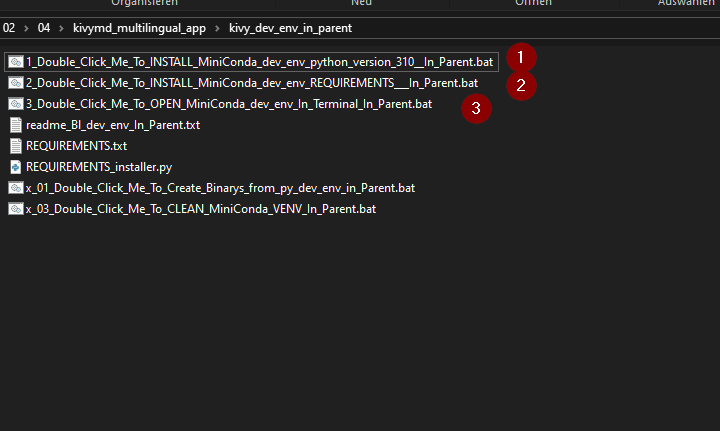
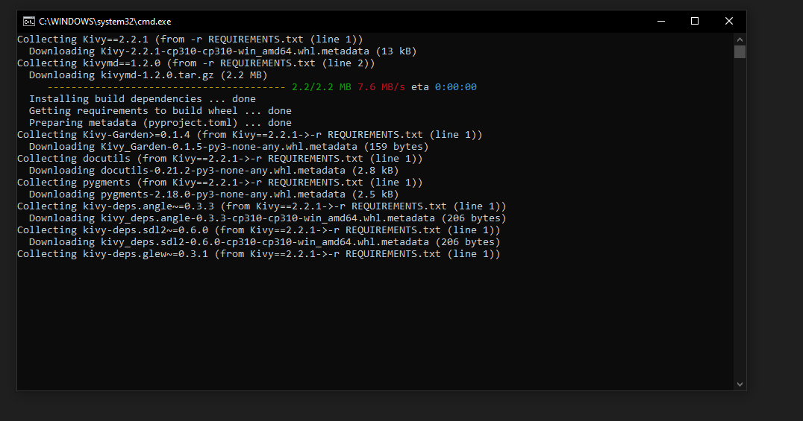
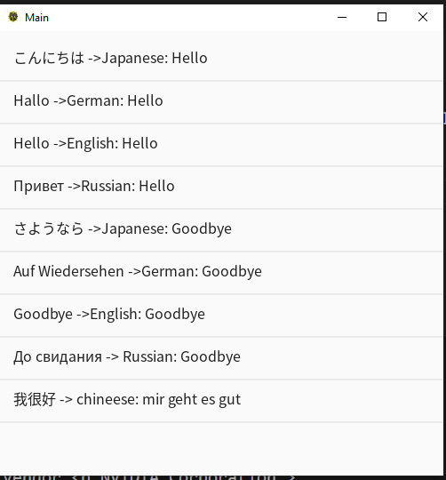

# kivymd_multilingual_app
a example app that shows multiligual list items

first create a virtual environment using the  helpers from dev_env folder (only windows)

then start the app by running 
multilingual_kivyMD_app.py

you should see something like this:

this is the code:
from kivy.lang import Builder
from kivymd.app import MDApp
from kivymd.uix.list import OneLineListItem

import os
current_dir = os.path.dirname(os.path.abspath(__file__))
str_font_foler:str='fonts'
str_font_file_name:str='NotoSansCJK-Regular.ttc'
str_font_file_path=os.path.join(current_dir,str_font_foler,str_font_file_name)

KV = '''
BoxLayout:
    orientation: 'vertical'

    ScrollView:
        MDList:
            id: my_list
'''

class MainApp(MDApp):
    def build(self):
        return Builder.load_string(KV)

    def on_start(self):
        # Add items to the MDList
        items = [
            "こんにちは ->Japanese: Hello",  # Japanese: Hello
            "Hallo ->German: Hello",      # German: Hello
            "Hello ->English: Hello",      # English: Hello
            "Привет ->Russian: Hello",     # Russian: Hello
            "さようなら ->Japanese: Goodbye",  # Japanese: Goodbye
            "Auf Wiedersehen ->German: Goodbye",  #German: Goodbye
            "Goodbye ->English: Goodbye",    # English: Goodbye
            "До свидания -> Russian: Goodbye",  # Russian: Goodbye
            "我很好 -> chineese: mir geht es gut ", #chineese: mir geht es gut 
        ]

        for item in items:
            list_item = OneLineListItem(text=f'[font={str_font_file_path}]{item}')
            self.root.ids.my_list.add_widget(list_item)

if __name__ == '__main__':
    MainApp().run()

this font supports at least:
this languages items = [
            "こんにちは ->Japanese: Hello",  # Japanese: Hello
            "Hallo ->German: Hello",      # German: Hello
            "Hello ->English: Hello",      # English: Hello
            "Привет ->Russian: Hello",     # Russian: Hello
            "さようなら ->Japanese: Goodbye",  # Japanese: Goodbye
            "Auf Wiedersehen ->German: Goodbye",  #German: Goodbye
            "Goodbye ->English: Goodbye",    # English: Goodbye
            "До свидания -> Russian: Goodbye",  # Russian: Goodbye
            "我很好 -> chineese: mir geht es gut ", #chineese: mir geht es gut 
        ]

hindi was not working while testing.